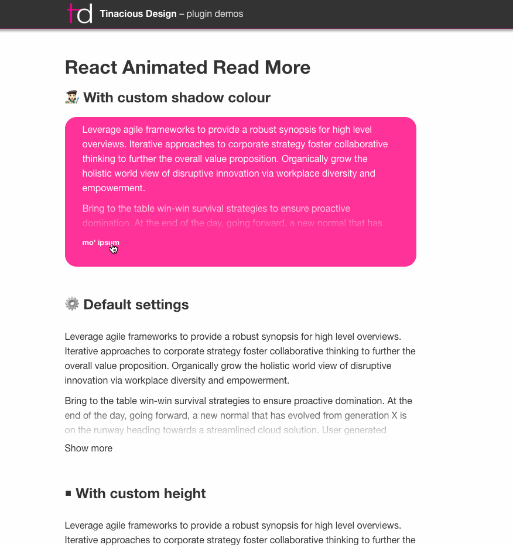

# React Animated Show More

[](https://app.codeship.com/projects/337134)

This is a simple, fully-customizable component that expands an area of text to show the rest of it.

Try out the [demo](https://tinacious.github.io/react-animated-show-more) for yourself.




## Features

- Supports custom toggle component, otherwise shows "Show more" or "Show less"
    - `toggle` (React component) – should implement prop `isOpen`
- Configurable properties
    - `height` (in pixels, default: `200`)
    - `speed` (in milliseconds, default: `300`)
    - `shadowColor` (any colour format, default: `#fff`)


## Peer dependencies

- React v16.8+ (uses hooks)


## Usage

The component wraps around your lengthy text section.

```jsx
<AnimatedShowMore
  height={100}
  toggle={({ isOpen }) => isOpen ? 'Close!' : 'Open!' }
  speed={2000}
  shadowColor="#000">

  {/* Lots of stuff goes here */}
  <DemoText />

</AnimatedShowMore>
```
